# HARIS (حارس) — Adversarial Red-Team Threat Taxonomy

> **Document Version:** 1.0.0  
> **Target Phase:** Phase 6A (Baseline Benchmark) & Phase 6B (Red-Team Hardening)  
> **Status:** ACTIVE SPECIFICATION  

---

## 1. Executive Summary

This taxonomy defines the formal catalog of adversarial manipulation techniques, evasion tactics, and linguistic/technical edge cases designed to stress-test the **HARIS Arabic Scam Intelligence** engine.

Security assistants that optimize solely for recall (catching all scams) inevitably generate intolerable false positive rates on legitimate urgent alerts, banking notifications, and dialectal communications. Conversely, systems that rely on naive keyword matching are trivially bypassed by obfuscation, transliteration, or linguistic misdirection.

This document identifies **16 distinct adversarial categories** to be subjected to red-team attacks in Phase 6B.

---

## 2. Adversarial Categories Taxonomy

```mermaid
graph TD
    classDef adv fill:#1e293b,stroke:#ef4444,stroke-width:2px,color:#fff;
    classDef cat fill:#0f172a,stroke:#38bdf8,stroke-width:1px,color:#fff;

    Root["HARIS Adversarial Threat Matrix"] --> LING["Linguistic & Semantic Evasion"]
    Root --> STRUCT["Structural & Technical Deception"]
    Root --> MULTI["Multimodal & Visual Misdirection"]
    Root --> CONTEXT["Contextual & Intent Inversion"]

    LING --> A1["1. Arabizi Transliteration"]:::adv
    LING --> A2["2. Deliberately Broken Arabic"]:::adv
    LING --> A3["3. Unicode Confusables & Tatweel"]:::adv
    LING --> A4["4. Excessive Emojis & Punctuation"]:::adv
    LING --> A5["5. Mixed Arabic/English Concealment"]:::adv

    STRUCT --> B1["6. Benign Suspicious-Looking Domains"]:::adv
    STRUCT --> B2["7. Multiple / Decoy URLs"]:::adv
    STRUCT --> B3["8. Suspicious URL + Benign Message"]:::adv
    STRUCT --> B4["9. Scam Language Without Any URL"]:::adv
    STRUCT --> B5["10. Distraction Text + Hidden Command"]:::adv

    MULTI --> C1["11. Misleading Screenshot Layout"]:::adv
    MULTI --> C2["12. Visual Brand Resemblance"]:::adv
    MULTI --> C3["13. Low-Quality / Blurred Evidence"]:::adv

    CONTEXT --> D1["14. Brand Mention Without Impersonation"]:::adv
    CONTEXT --> D2["15. Legitimate Urgency"]:::adv
    CONTEXT --> D3["16. Legitimate Negative OTP Warnings"]:::adv
```

---

### Category 1: Brand Mention Without Impersonation (Contextual Inversion)
- **Threat Mechanism:** User or sender mentions a reputable financial or government brand (e.g. "مصرف الراجحي", "بنك الكريمي", "أبشر", "STC") in an inquiry, complaint, review, or neutral comparison without claiming to represent that entity.
- **Naive Classifier Failure:** Rule-based systems trigger `impersonation` feature solely because the brand keyword appears in text.
- **Example:** `"السلام عليكم يا بو فهد، هل جربت تمويل مصرف الراجحي الجديد؟ ودي أعرف كيف خدمتهم."`
- **Required Defense:** Contextual grounding checking for first-person representation claims (`"نحن"`, `"عزيزي العميل"`, `"إشعار من"`) vs third-person neutral inquiry.

---

### Category 2: Legitimate Negative OTP Warnings (Polarity Inversion)
- **Threat Mechanism:** Legitimate security advisories mention the exact phrase `"رمز التحقق OTP"` or `"كلمة المرور"` to warn users *never* to share it.
- **Naive Classifier Failure:** The token `"OTP"` triggers the `otp_request` threat feature, causing high-confidence false positives on security advisories.
- **Example:** `"تحذير أمني: موظف البنك لن يطلب منك قط رمز التحقق OTP. لا تفصح عنه لأي شخص."`
- **Required Defense:** Clause-level negation detection (`"لن يطلب"`, `"إياك ومشاركة"`, `"احذر من إعطاء"`) that suppresses the `otp_request` signal.

---

### Category 3: Legitimate Operational Urgency (Temporal Pressure Inversion)
- **Threat Mechanism:** Legitimate administrative, medical, or corporate messages containing real deadlines (e.g. subscription renewal, meeting time, flight departure) without malicious intent.
- **Naive Classifier Failure:** The presence of `"عاجل"`, `"اليوم"`, or `"خلال ساعتين"` fires the `urgency` threat feature.
- **Example:** `"تنبيه: ينتهي اشتراك النادي الرياضي اليوم الساعة 10 مساءً. للتجديد يرجى مراجعة الاستقبال بالفرع."`
- **Required Defense:** Distinguishing operational deadlines with offline/in-person actions from artificial panic designed to induce online credential surrender.

---

### Category 4: Benign Suspicious-Looking Domains (Technical Ambiguity)
- **Threat Mechanism:** Completely legitimate institutions (academic portals, regional government departments, developer consoles, obscure national domains like `.edu.ye` or `.gov.om`) with long subdomains or unusual paths.
- **Naive Classifier Failure:** Deep subdomain counters or path anomaly heuristics flag the legitimate URL as malicious.
- **Example:** `https://portal.student-records.su.edu.ye/grades/2026/semester2`
- **Required Defense:** Multi-tier domain reputation hierarchy giving precedence to authorized institutional second-level domains (`.edu`, `.gov`, `.ac`).

---

### Category 5: Arabizi Obfuscation (Script Evasion)
- **Threat Mechanism:** Phishing instructions written in Arabizi (Arabic phonetically spelled in Latin characters with numerals such as `3=ع, 7=ح, 2=ء/ق`) to bypass Arabic NLP dictionaries.
- **Naive Classifier Failure:** Arabic stemmers and tokenizers fail to detect any Arabic scam keywords.
- **Example:** `"ya 5oy 7sabk t36l 3shan el t7deeth. d5ol hna w 7ot el OTP bsor3a: https://bank-login.top/auth"`
- **Required Defense:** Bidirectional Arabizi phonetic mapping and multimodal semantic evaluation capable of parsing transliterated intent.

---

### Category 6: Unicode Confusables & Tatweel Padding (Character Evasion)
- **Threat Mechanism:** Inserting zero-width spaces, Arabic tatweel (`ـ`), Cyrillic homoglyphs, or soft hyphens inside critical keywords (e.g. `بـنـك`, `كـلـمـة الـسـر`, `O Т Р` with Cyrillic Т).
- **Naive Classifier Failure:** Exact and regex pattern matchers fail to trigger on fragmented tokens.
- **Example:** `"عـزيـزي الـعـمـيـل: أرسـل رمـز الـتـحـقـق فوراً"`
- **Required Defense:** Canonical Unicode normalization (NFKC) combined with stripped tatweel and diacritics prior to all downstream tokenization.

---

### Category 7: Excessive Emojis & Stylistic Noise (Visual Overload)
- **Threat Mechanism:** Flooding the message with excitement emojis (`💥`, `🎉`, `🎁`, `🔥`) and repeated punctuation (`!!!!`, `????`) commonly associated with prize scams, but used by legitimate e-commerce stores.
- **Naive Classifier Failure:** Heuristics penalize stylistic loudness, causing legitimate merchant marketing to be flagged as suspicious.
- **Example:** `"🔥 عروض نهاية الأسبوع الكبرى!! اشتري قطعتين والتالتة مجاناً في جميع فروعنا 🎁"`
- **Required Defense:** Decoupling stylistic loudness from security threat features; evaluating the core call to action rather than punctuation density.

---

### Category 8: Deliberately Broken / Machine-Translated Arabic (Syntactic Anomaly)
- **Threat Mechanism:** International threat actors using automated machine translators, producing grammatically disjointed or alien Arabic syntax.
- **Naive Classifier Failure:** Natural Arabic n-gram parsers and dialect models fail to match expected colloquial or MSA grammatical structures.
- **Example:** `"مرحبا أنا السيدة إليزابيث نحن نرى سيرتك ممتاز، نريد دفع لك 500 دولار يوم للعمل تقييم بيتك."`
- **Required Defense:** Semantic intent extraction that prioritizes transactional relationships (unsolicited payment for trivial tasks) over grammatical fluency.

---

### Category 9: Mixed Arabic / English Concealment (Bilingual Fragmentation)
- **Threat Mechanism:** Splitting the threat across language boundaries (Arabic context with English credential harvesting, or English brand with Arabic urgency).
- **Naive Classifier Failure:** Monolingual classifiers lose context across language transitions.
- **Example:** `"Your Apple ID has been locked for security. يرجى تسجيل الدخول لتأكيد الهوية: https://apple-verify.id.cc"`
- **Required Defense:** Unified bilingual token processing and shared cross-lingual feature extractors.

---

### Category 10: Misleading Screenshots / Asymmetric Visual Layout (Visual Spoofing)
- **Threat Mechanism:** A screenshot containing a completely benign header or status bar, but with a malicious credential-stealing text message or prompt embedded in the middle.
- **Naive Classifier Failure:** OCR extracts top-level benign brand logos and prematurely classifies the image as an official communication.
- **Required Defense:** Bounded visual fusion: visual cues alone cannot grant immunity to malicious extracted text or links.

---

### Category 11: Visual Brand Resemblance (Color & Icon Spoofing)
- **Threat Mechanism:** A phishing page adopting the exact corporate color palette (e.g. Al-Rajhi blue/yellow, STC purple) and icons, but with malicious form fields.
- **Naive Classifier Failure:** Visual models over-rely on brand branding and either falsely trust or misattribute the site.
- **Required Defense:** Strict cryptographic separation between visual appearance and actual domain authentication.

---

### Category 12: Decoy & Multiple URLs (URL Splitting)
- **Threat Mechanism:** A message containing multiple URLs: a legitimate link (e.g. `https://google.com` or `https://apple.com`) alongside a malicious shortlink.
- **Naive Classifier Failure:** The scanner only inspects the first discovered URL, missing the secondary phishing link.
- **Required Defense:** Exhaustive array processing: every extracted URL must be individually and independently analyzed by the passive URL engine.

---

### Category 13: Contradictory Evidence (Signal Dissonance)
- **Threat Mechanism:** A message containing contradictory signals (e.g. an authentic government sender ID but a third-party shortlink, or polite formal greeting followed by extortion threats).
- **Naive Classifier Failure:** Linear weighted scoring averages out the signals, resulting in an ambiguous mid-tier score that fails to alert the user.
- **Required Defense:** Maximum-threat override: high-severity deterministic indicators (credential harvesting, malicious domain) strictly anchor minimum suspicion regardless of mitigating context.

---

### Category 14: Scam Language Without Any URL (Social Directing)
- **Threat Mechanism:** Scams that never include a link, instead directing the victim to call a phone number, send a WhatsApp message, or perform a manual ATM transfer.
- **Naive Classifier Failure:** Systems that rely heavily on URL reputation miss offline and phone-based social engineering.
- **Example:** `"مبروك فزت بجائزة 50 ألف ريال من مسابقة الحلم. اتصل فوراً بالرقم 00234... لاستلام شيك الجائزة."`
- **Required Defense:** Robust behavioral intent recognition (contact pressure, financial lure, unexpected contact).

---

### Category 15: Suspicious URL Embedded in Benign Holiday Greeting (Trojan Messaging)
- **Threat Mechanism:** A warm, benign religious or social greeting (Eid, Ramadan, National Day) containing an innocuous-looking link leading to malware or credential theft.
- **Naive Classifier Failure:** Semantic sentiment analysis classifies the text as warm and positive (+0.95), ignoring the dangerous technical link payload.
- **Example:** `"كل عام وأنتم بخير بمناسبة عيد الفطر المبارك! شاهد كارت المعايدة الخاص بك من هنا: https://eid-card.click/view"`
- **Required Defense:** Asymmetric threat precedence: technical danger indicators in links strictly override warm or benign linguistic sentiment.

---

### Category 16: Distraction Text with Hidden Injection Instruction (Context Drowning)
- **Threat Mechanism:** A 300-word paragraph of legitimate news, sports commentary, or Quranic verses, with a single malicious instruction or link buried in the middle or end.
- **Naive Classifier Failure:** Bag-of-words or embedding models become diluted by the overwhelming benign token mass.
- **Example:** `[300 words of daily economic analysis...] "وفي سياق آخر حول رسوم تجديد اشتراكك 100 ريال لهذا الحساب: 0102..."`
- **Required Defense:** Granular sentence-level signal scanning and localized intent extraction.

---

## 3. Evaluation & Red-Team Testing Strategy for Phase 6B

| Adversarial Class | Test Methodology | Success Criterion |
|---|---|---|
| **Polarity Inversions** (OTP warnings, legitimate urgency) | Negative assertion suites | Zero false positives on legitimate security warnings |
| **Transliteration & Obfuscation** (Arabizi, Unicode) | Normalized invariant testing | Ground truth signals correctly extracted despite script evasion |
| **Technical Deception** (Decoy URLs, IP hosts) | Exhaustive URL pipeline testing | All URLs scanned; worst-case anomaly dominates |
| **Multimodal Dissonance** (Visual spoofing) | Vision-text cross validation | Visual evidence cannot mask malicious text payloads |
